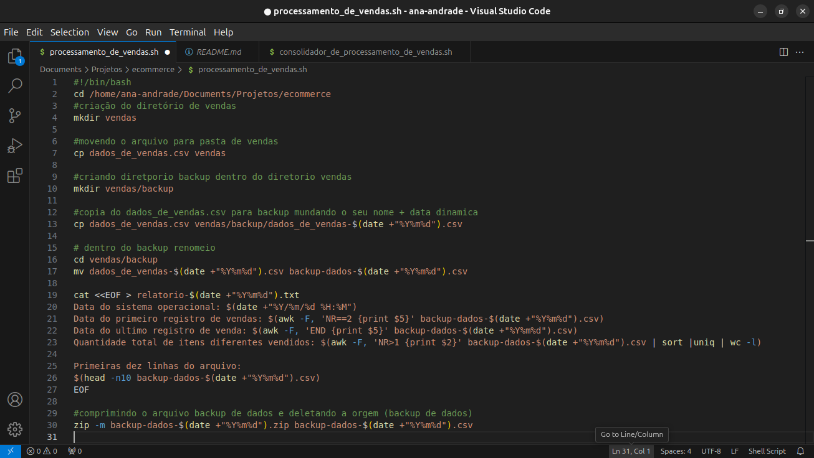
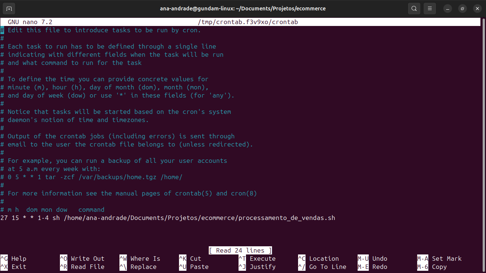
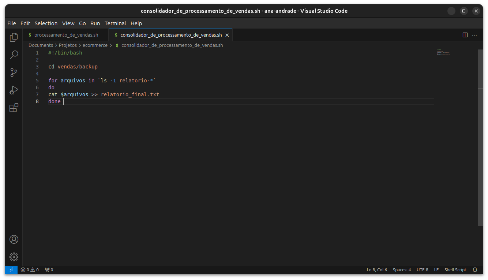
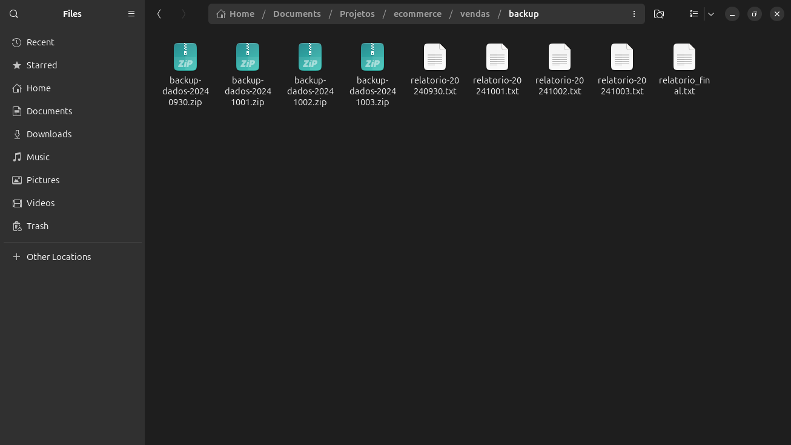

# Sprint 1

## Resumo da Sprint 

Na sprint 1 adquiri conhecimentos sobre Linux, Git, Github e Markdown.

Primeiramente sobre Linux aprendi sobre comandos básicos do sistema, gerenciamentos de arquivos, diretórios, aplicativos, editores de texto e muitas outras funcionalidades do sistema. 

Também adquiri grandes conhecimentos sobre git, usando git bash e o terminal do vscode aprendi a criar, clonar, modificar, atualizar e muitas outras funçoes para o uso e manuseio de repositórios no github que também aprendi a usar o site de maneira bem completa para manuseio destes mesmos repositório.
Por fim foi proposto um desafio com uso do Linux e depois de concluido usei o git e github para manusea-lo e o colocar a mostra.

## Evidências 

### script 1
#### Depois de criado diretório (com moção do arquivo vendas para ele) e arquivo executável, parto para a criação do script em bash como podemos ver nas imagens a seguir.

### Crontab
#### Agendamento no scheduler crontab nos dias e hora solicitados.

### Script 2
#### Faço a criação de outro script em bash para consolidação de relatórios.

### Arquivos gerados
#### Depois das execucções agendadas e execução manual do consolidador todos arquivos foram gerados.

