### Neste desafio foi disponibilizado um arquivo csv com vários dados sobre apps da google play store, encima desses dados foram solicitadas algumas análises com ou sem uso de gráficos.

### 1. Primeira etapa 
#### (Gráfico de barras para os top 5 apps por número de instalação)

No primeiro exercício foi solicitado um gráfico de barras.

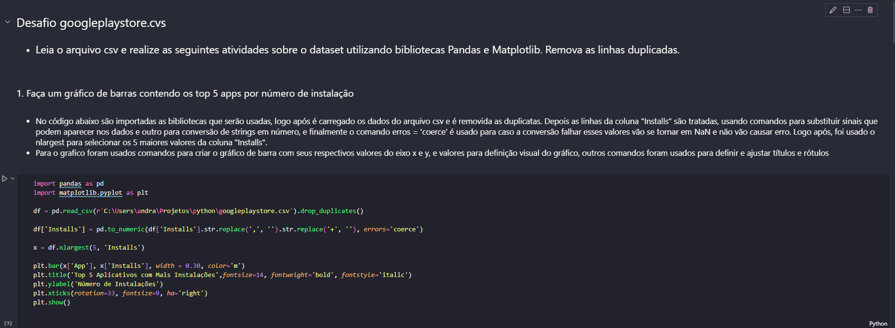
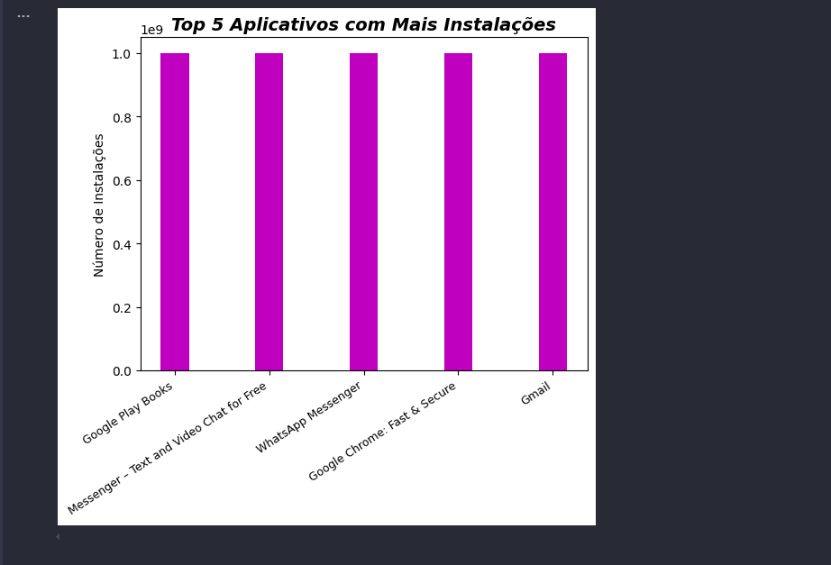

### 2. Segunda etapa 
#### (Gráfico de pizza (pie chart) mostrando as categorias de apps existentes no dataset de acordo com a frequência em que elas aparecem.)

No segundo exercício foi solicitado um gráfico de pizza.

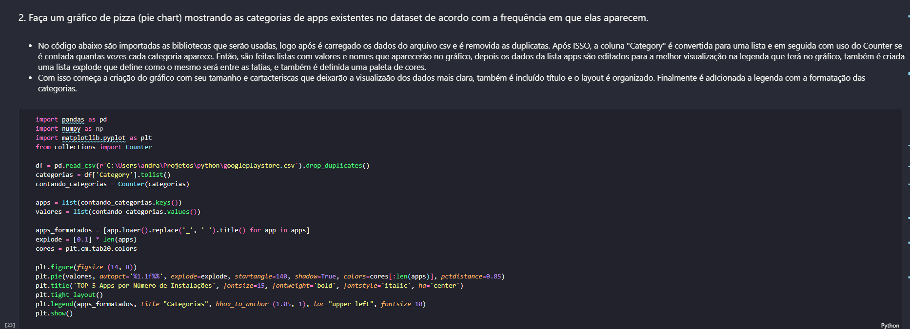
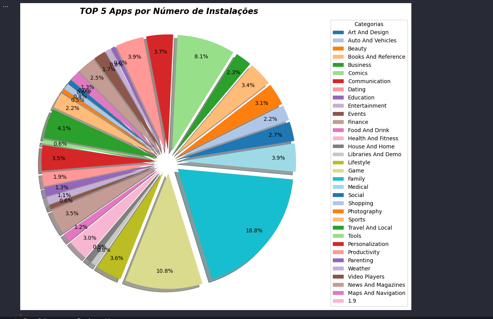

### 3. Terceira etapa 
#### (Mostre qual app mais caro existente no dataset.)

No terceiro exercício foi solicitado um código que mostrasse qual app mais caro

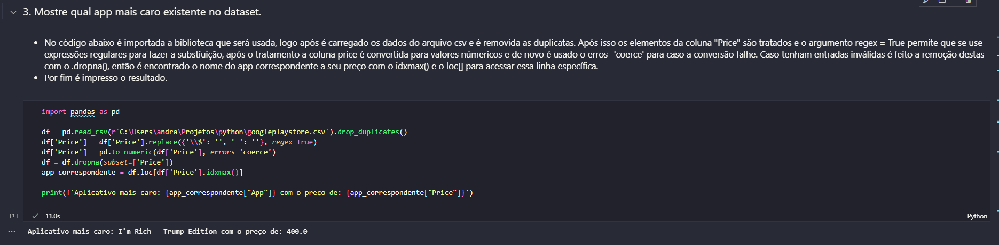

### 4. Quarta etapa 
#### (Mostre quantos apps são classificados como 'Mature 17+')

No quarto exercício foi solicitado um código que mostrasse quais apps eram classificados como 'Mature 17+'

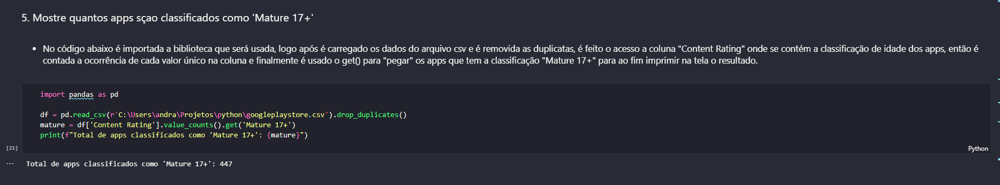

### 5. Quinta etapa 
#### (Mostre o top 10 apps por número de reviews bem como o respectivo número de reviews. Ordene a lista de forma descrescente por número de views.)

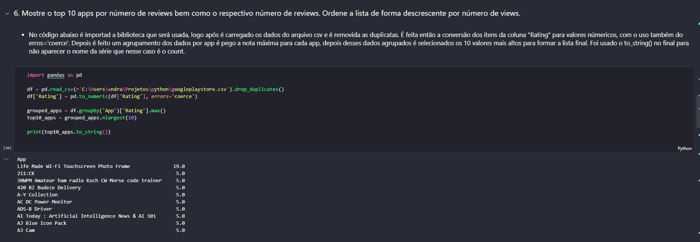

### 6. Sexta etapa 
#### (Crie pelo menos mais 2 cálculos sobre o dataset e apresente um em formato de lista e outro em formato de valor. Por exemplo: "top 10 apps por número de reviews" e "o app mais caro existente no dataset")

**Média, Mediana e Desvio Padrão das notas dadas aos apps.**

Resolvi fazer um cálculo que irá me retorna a média, mediana e desvio padrão, resolvi mostrar apenas duas casas decimais para deixar a visualização do gráfico que será feito posteriormente melhor.

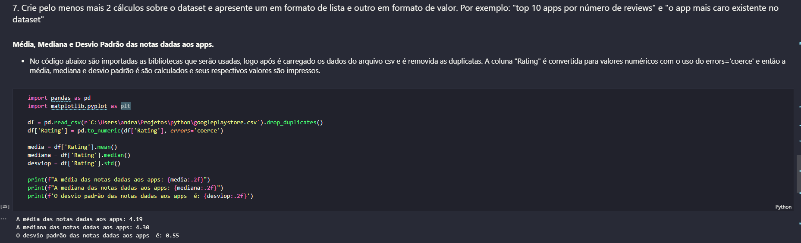

**Quantidade de Apps por categoria.**

Para o retorno de uma lista resolvi fazer um código que conta as 10 categorias com mais apps.

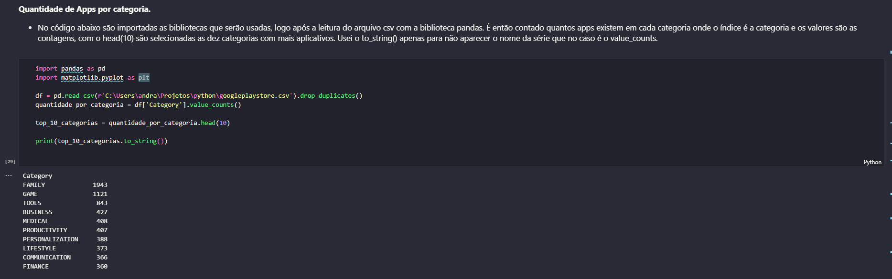

### 7. Sétima etapa 
#### (Crie pelo menos outras 2 formas gráficas de exibição dos indicadores acima utilizando a biblioteca matplotlib. Escolha tipos de gráficos diferentes dos explorados acima. Por exemplo: linhas e dispersão.)

* Para representação da média, mediana e desvio padrão usei um gráfico de linhas

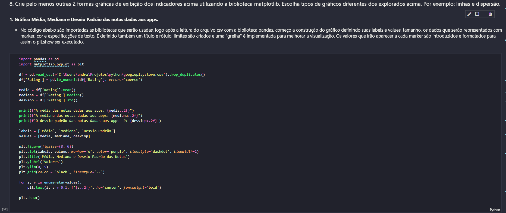
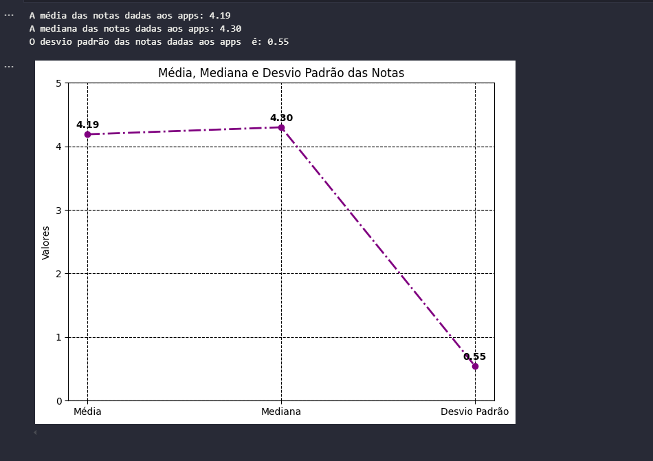

* Para representação das 10 categorias com mais apps

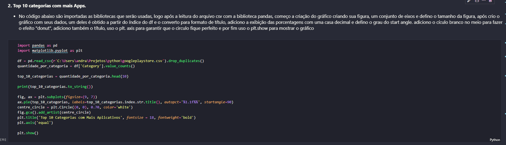

