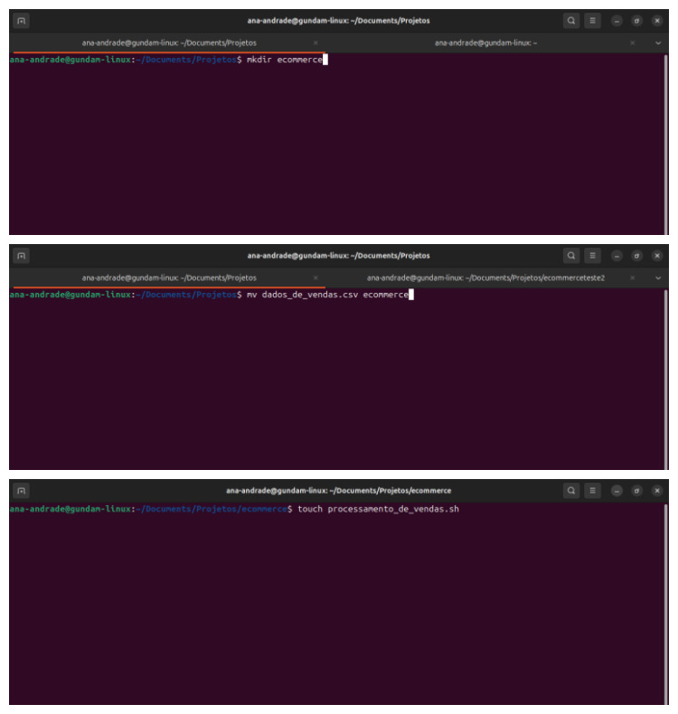
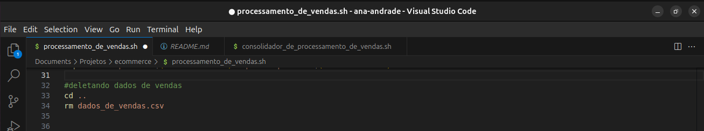
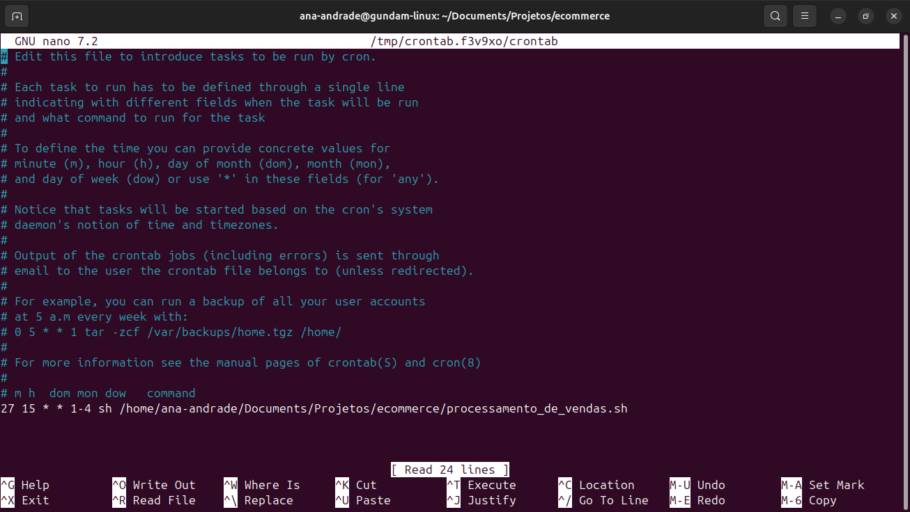
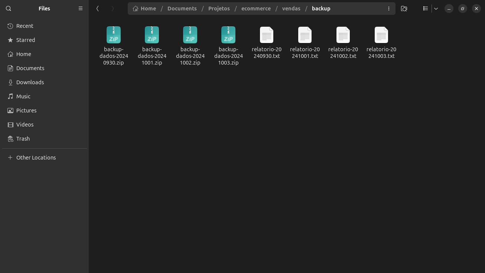

### 1. Primeira etapa 
#### (criando diretórios, movendo e criando arquivos)
  Primeiramente criei o diretório solicitado, movi o arquivo dados de vendas para dentro deste dirório e logo após criei o arquivo executável.

### 2. Segunda etapa 
#### (estruturação do primeiro script em bash)
  Depois disso já dentro do arquivo criei um scrip em bash, lá usei alguns comandos para criação de diretórios, copia e mudança de nomes de arquivos, então fiz a criação do do relatório.txt onde terá algumas informações e para estas usei comandos especificos que as representasse, após isso fiz um zip em um arquivo e deletei outros solicitados.

### 3. Terceira etapa 
#### (agendamento no crontab)
  Fiz o agendamento da execução no scheduler crontab para executar o arquivo processamento de vendas de segunda a quinta às 15:27.

  

### 4. Quarta etapa 
#### (estruturação do segundo script em bash)
  Criei mais um script em bash desta vez para consolidar todos os relatórios que seriam gerados em um só usando um loop.

### 5. Quinta etapa 
#### (modificação dos dados contidos no arquivos dados de vendas)
  Todos os dias de execução o arquivo dados de vendas.csv era modificado manualmente.

### 6. Sexta etapa 
#### (execução manual do segundo script para gerar o relatório final)
  Depois de todas as execuções agendadas no crontab, executei manualmente o segundo script que consolida todos arquivos gerados.

  
