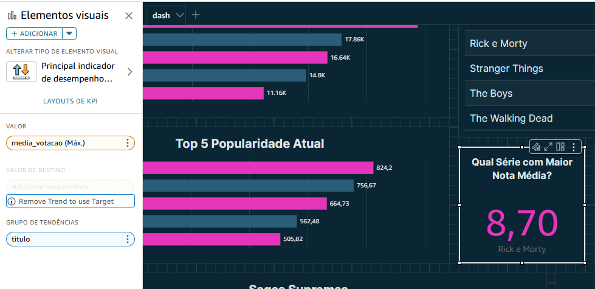
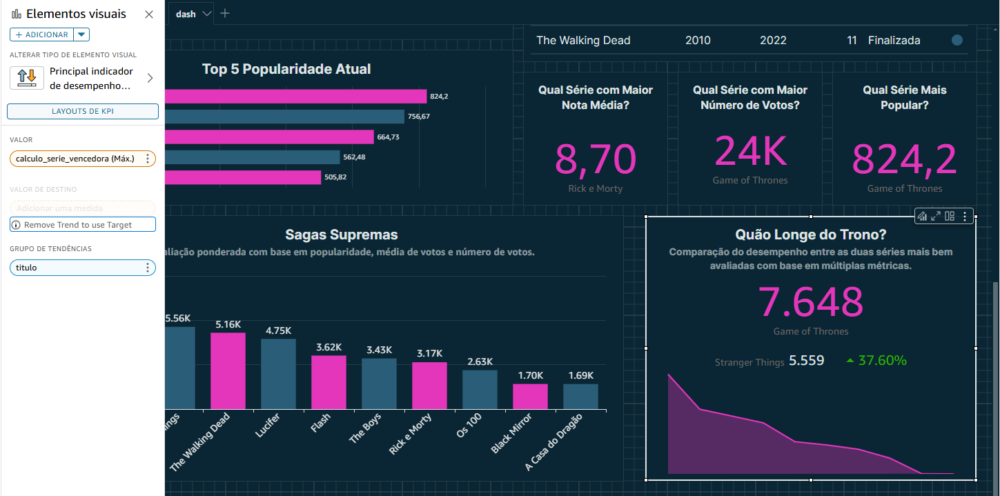
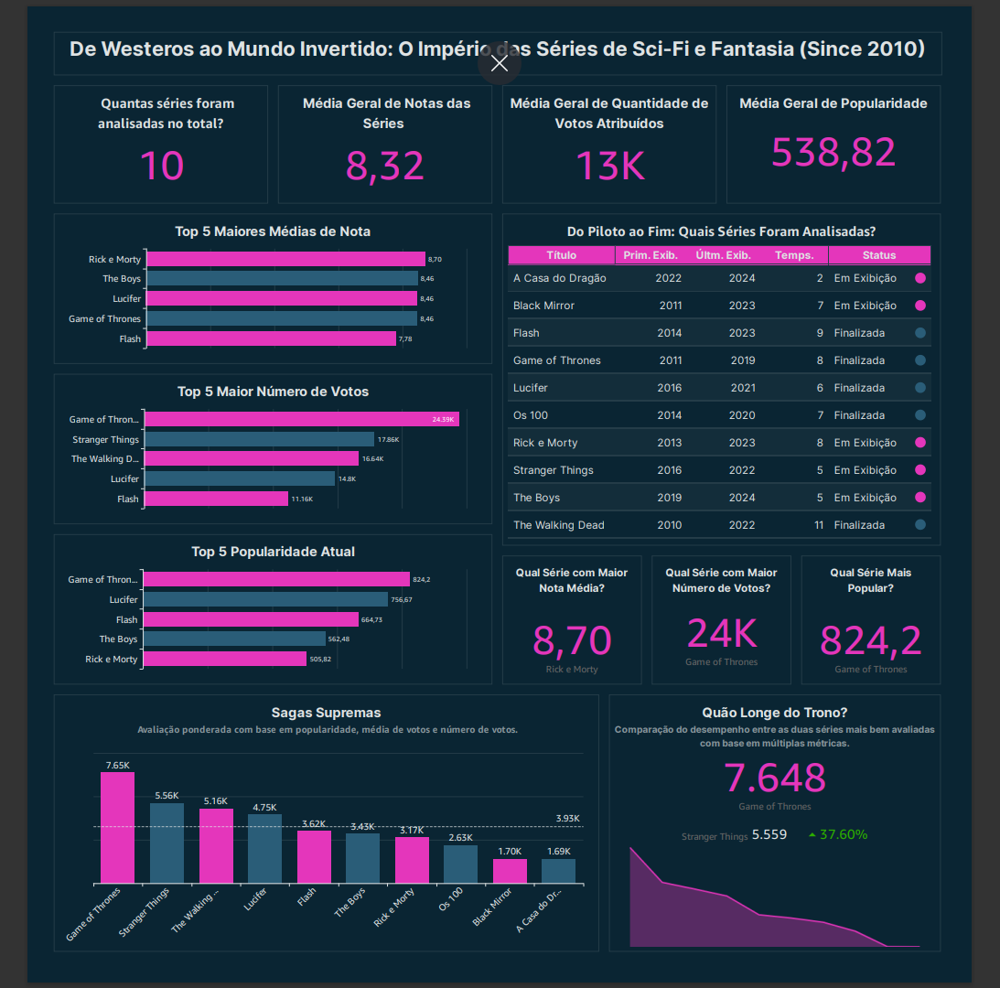

### Desafio Final: Entrega Final.

### Descrição:
 - Como foi a criação do meu Dashboard e qual foi minha intenção?
   

### 1. Primeira etapa.
#### (Preparação dos dados)

- Join entre tabelas: Criei uma base unificada no QuickSight realizando um join entre as tabelas dim_series e fato_series. Esse processo consolidou as informações necessárias para a análise.

### 1.1
#### (Criação de campos calculados)

- *Foram adicionadas novas colunas para aprimorar a análise:*
  
- Extração do ano da primeira e última exibição da série.
     
- Tradução do status da série para português
   - *Esse campo só foi mudado dentro do quicksight pois a idéia era usá-lo de outra maneira, mas ao usar ele em uma tabela percebi que seria melhor para sua visualização a língua ser português.)*
     
- Criação de um cálculo da série vencedora, combinando métricas-chave.
   - *A razão e cáculo serão explicados posteriormente quando forem usados*
     

- *Campo calculado "calculo_serie_vencedora"*
  

- *Campo calculado: Extração do ano da primeira exibição*
  

- *Campo calculado: Extração do ano da última exibição*
  

### 2. Segunda Etapa 

#### (Costrução do dashboard)
 - *Construção das KPIs. Para destacar informações essenciais, foram criadas KPIs com métricas globais:*

### 2.1 
### KPIS

- Total de séries analisadas: Contagem distinta dos títulos.

- Média geral das notas: Valor médio da coluna media_votacao.

- Média geral do número de votos: Valor médio da coluna num_votos.

- Média geral da popularidade: Valor médio da coluna popularidade.

### 2.2

- *Foram criados gráficos de barras horizontais para destacar as séries de maior destaque:*

### Gráficos de Ranking

- Top 5 - Maiores médias de nota.

- Top 5 - Maior número de votos.

- Top 5 - Séries mais populares atualmente.

### Aplicando Filtros 

- *Para que o gráfico me retornassse os cinco maiores valores de cada métrica criei três filtros iguais para este propósito*

### 2.3
### Criação da Tabela "Do Piloto ao Fim".

- *Foi criada uma tabela para mostrar todas as séries analisadas, com as seguintes colunas:*
 1. Título
 2. Primeira Exibição
 3. última Exibição
 4. Status da Série (Em exibição ou Finalizada)

  
### Formatação Condicional

- Apliquei ícones com cores para indicar visualmente se a série está finalizada ou ainda em exibição.

 

### 2.4
### KPIS as melhores no geral.

- *Kpis representando:*
  
- Série com maior nota média;

 - Série com  maior número de votos;
   

  - Série mais popular.
    
 

### 2.5
### Cálculo da Série Vencedora

- *Para determinar a melhor série, criei um campo calculado que atribui pesos diferentes para três métricas em um cálculo, que definirá uma nota final para cada série*

- *Quais são essas métricas?*
  
  - Popularidade (peso maior, pois o TMDB avalia com base em diversos fatores, como tráfego na página, engajamento social, número de acessos e interações no site/app).   *Peso: 0.4*
    
  - Média de Votação.   *Peso: 0.3*
    
  - Número de votos.   *Peso 0.3*

### 2.6
### Visualização das Melhores Séries

- Criei um gráfico de barras verticais para exibir o ranking final das séries com base no cálculo da série vencedora.

### 2.7
### Comparação Final

- Uma última KPI foi adicionada para comparar a melhor série com o segundo lugar, utilizando o mesmo cálculo de ranking.

## Resultado Final do Dashboard 

### De Westeros ao Mundo Invertido: O Império das Séries de Sci-Fi e Fantasia 

