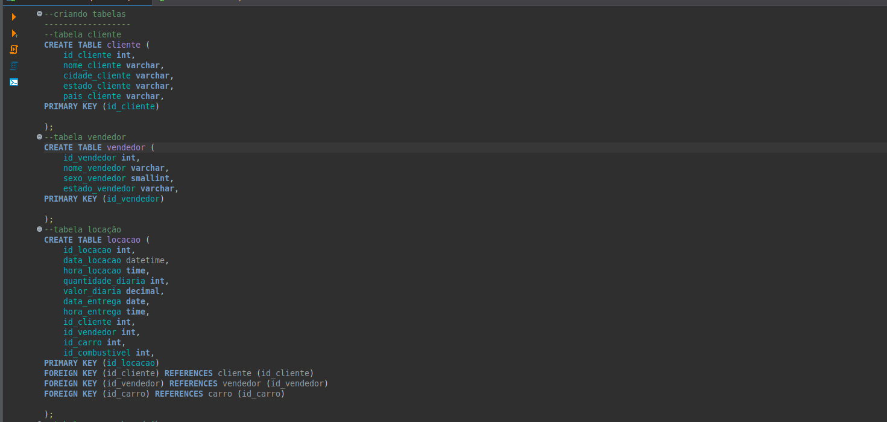
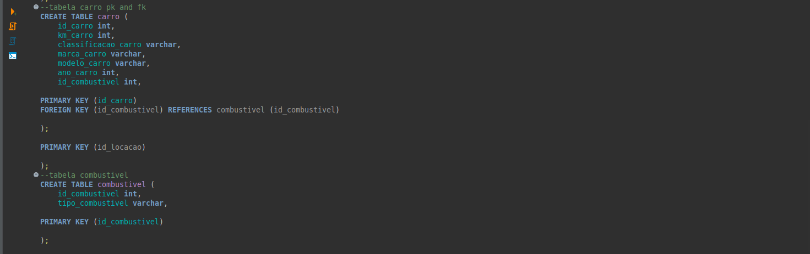
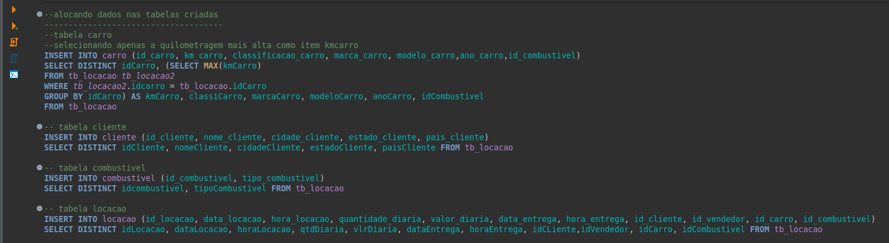
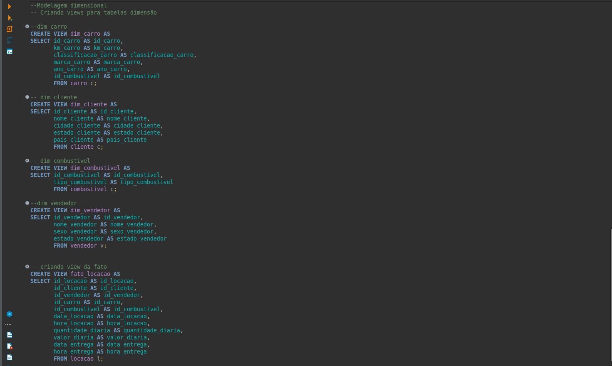
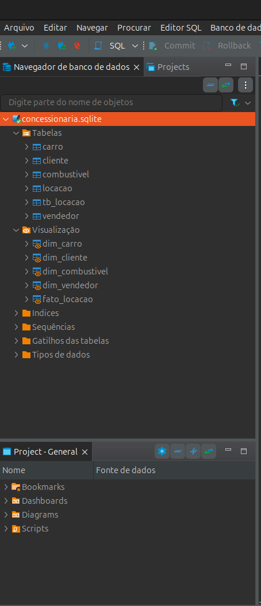
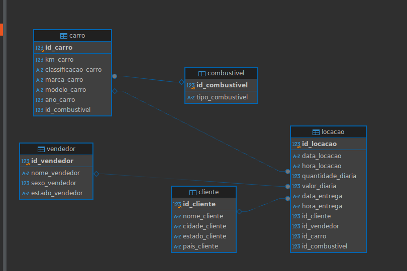
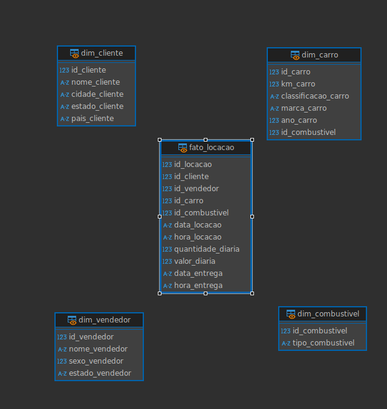

### 1. Primeira etapa 
#### (criando tabelas para normalização)
  Primeiramente, criei todas tabelas que julguei necessárias com suas respectivas pks e fk. 

### 2. Segunda etapa 
#### (alocando dados nas tabelas criadas)
  Depois disso inseri os dados contidos na tb_locação para as novas tabelas relacionais criadas dando atenção ao item kmcarro que foi usado um subselect para selecionar apenas a quilometragem mais atual do carro na tabela normalizada.

### 3. Terceira etapa 
#### (Criando a modelagem dimensional)
  Depois de terminada a modelagem relacional, parti para a modelagem dimensional usando as tabelas que foram normalizadas na modelagem relacional,. criando views para as tabelas dimensões e fato

#### Tabelas e views no banco de dados

### Diagrama das tabelas criadas na modelagem 
#### modelagem relacional

#### modelagem dimensional 

  
