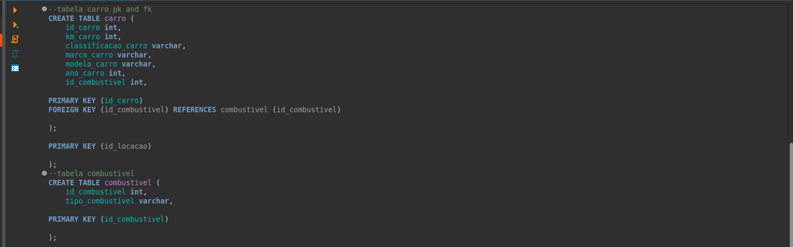

# Sprint 2

## Resumo da Sprint 

Na sprint 2 adquiri conhecimentos sobre SQL.

Sobre SQL começamos aprendendo de comendos básicos a querys elaboradas e avançadas, foi proposto alguns exercícios com dois bancos de dados diferentes, onde pude aplicar o que já tinha aprendido e aprofundar meu conhecimento ainda mais com novos desafios, que cada execício proporcionava.

Após isso, também aprendi sobre modelagem de dados e suas peculiaridades e com essa foi proposto o desafio da sprint, onde foi prosposto a modelagem relacional e dimensional de uma tabela que nos foi fornecida.

## Evidências 

### Normalizando tabelas
#### modelagem relacional

### Views
#### modelagem dimensional

