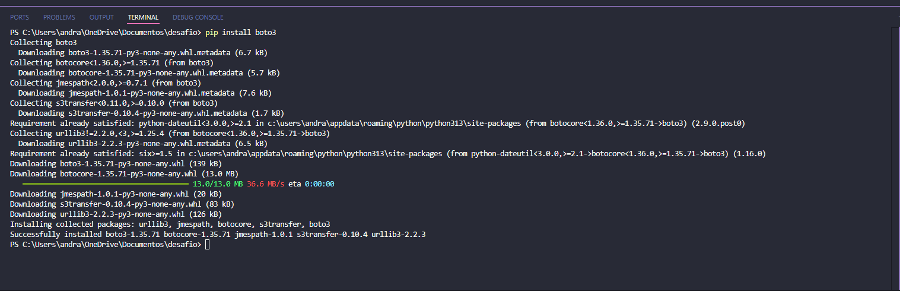
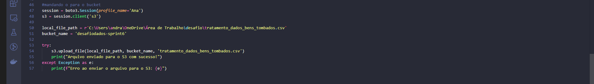
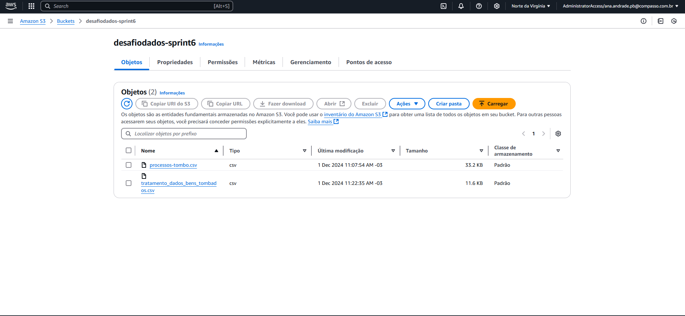

### Desafio AWS S3.

### 1. Primeira etapa 
#### (Criação do bucket na AWS)

### 2. Segunda etapa 
#### (Instalção da CLI e configuração da mesma.)

### 3. Terceira etapa 
#### (Download da biblioteca boto3)

### 4. Quarta etapa 
#### (Enviando o arquivo CSV (conjunto de dados) escolhido para o bucket no S3)
*O código cria uma sessão com as credenciais do perfil e conecta ao S3 da AWS. Depois, ele faz o upload de um arquivo localizado no computador (no caso, processos-tombo.csv) para o bucket desafiodados-sprint6. Se o envio for bem-sucedido, ele imprime uma mensagem confirmando o envio. Caso aconteça algum erro, ele captura o problema e exibe uma mensagem de erro.*

### 5. Quinta etapa 
#### (tratamento de dados a partir da leitura do arquivo no bucket.)

*Depois de carregar os dados no DataFrame, o código começa a fazer algumas transformações nos dados. Ele adiciona novas colunas para organizar melhor as informações, como o ano do tombamento, a década, quantidade de tombamentos por município e a quantos anos ocorreu o tombamento do bem. Também aplica alguns filtros, pegando apenas os dados que atendem a certos critérios, como os tombamentos de bem imóvel ou conjunto paisagístico que aconteceram entre 1970 e 1999.*

*Depois de tudo isso, o código salva o resultado em um arquivo CSV no computador local. E faz o upload desse arquivo novo para o S3, no mesmo bucket. O código confirma o sucesso da leitura e do envio, mas se algo der errado, ele exibe uma mensagem de erro.*

### 6. Resultados dos obejetos no bucket do S3 
#### (Print dos dois arquivos no Bucket 'desafiodados-sprint6' o original e o novo gerado.)

