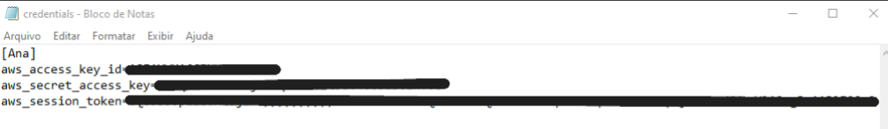

### Desafio AWS S3.

### 1. Primeira etapa 
#### (Criação do bucket)

### 2. Segunda etapa 
#### (Instalção da CLI, configuração da mesma e download da biblioteca boto3)

### 3. Criação do container 
* Comando usado para criar o container 
  (**docker run -it --name cont_carg img_carg**)

### 4. Etapa 2 (Questionamento levantado) 
* É possivel reutilizar containers? Em caso positivo, apresente o comando necessário para reiniciar um dos containers parados em seu ambiente Docker, não sendo possível reutilizar, justifique sua resposta.

* Depois de parar o container com o comando **docker stop >container<** , usei o comando **docker start -i >container<** para roda-lo novamente.

### Na segunda parte do desafio foi pedida a criação de um novo script Python que implementa o algoritmo a seguir:
1. Receber uma string via input.
* Gerar o hash da string por meio do algoritmo SHA-1.
* Imprimir o hash em tela, utilizando o método hexdigest.
* Retornar ao passo 1.
2. Criar uma imagem Docker chamada mascarar-dados que execute o script Python criada anteriormente.
3. Iniciar um container a partir da imagem, enviando algumas palaras para mascaramento.
  
## hash.py

### 1. Criei o arquivo Dockerfile e nele colquei suas instruções para ser executado. 

### 2. Foi criado o scrip Python que implenta o algoritmo. 

### 3. Criação da imagem mascarar-dados e container que executa o script python

### 3. Execução do container com o envio de palavras e dados para mascaramento. 

