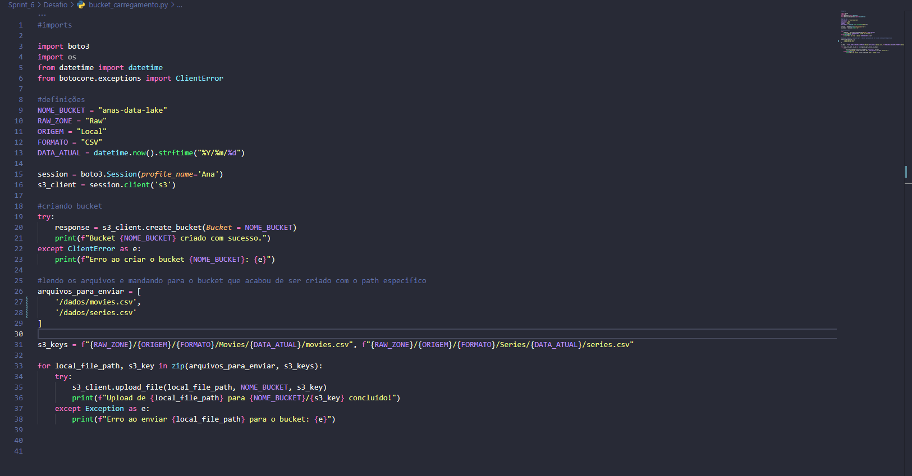
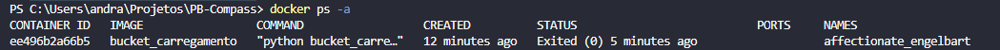
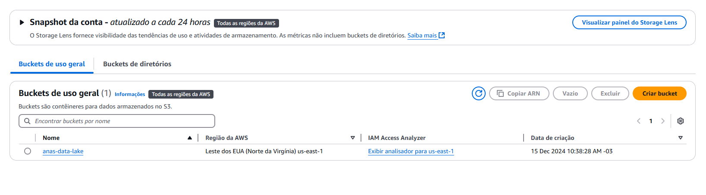
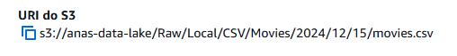

### Perguntas referentes aos dados: 

1. Verificar se séries relacionadas a grandes franquias (como Star Trek ou Game of Thrones) influenciam a popularidade geral dos gêneros.

2. Identificar séries que continuaram ativas por muitos anos, com base em anoLancamento e anoTermino.

3. Identificar se há períodos de "boom" de séries de Fantasia ou Sci-Fi (ex.: aumento nas décadas de 1990 ou 2010).
   
### Desafio Final: Entrega 1.

### 1. Primeira etapa.
#### (Criação do script em python.)
- *Ocorrem definições de configuração de caminho.*
- *Tentativa de criação do bucket*
- *Envio de arquivos locais para o recém criado bucket*

### 2. Segunda etapa.
#### (Criação do arquivo Dockerfile.)

### 3. Terceira etapa.
#### (Criação da imagem bucket_carregamento com o Dockerfile antes apresentado.)

- *listagem de imagens*

### 4. Quarta etapa.
#### (Execução do container com base na imagem chamada.)
- *Montagem volumes do sistema host para o contêiner.*
- *Ocorre também apontamento no sistema host onde as credenciais e configurações da AWS são armazenadas.*

- (Container rodado)

### 5. Resultados. 
#### (anas-data-lake já criado na AWS)

### 6. Resultados.
#### (caminhos com padrão solicitado)

