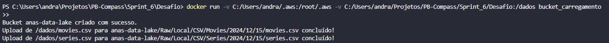

### Perguntas referentes aos dados: 

### Desafio Final: Entrega 1.

### 1. Primeira etapa 
#### (Criação do script em python.)
- *Ocorrem definições de configuração de caminho.*
- *Tentativa de criação do bucket*
- *Envio de arquivos locais para o recém criado bucket*

### 2. Segunda etapa 
#### (Criação do arquivo Dockerfile.)

### 3. Terceira etapa 
#### (Criação da imagem bucket_carregamento com o Dockerfile antes apresentado.)

- *listagem de imagens*

### 4. Quarta etapa 
#### (Execução do contêiner com base na imagem chamada.)
- *Montagem volumes do sistema host para o contêiner.*
- *Ocorre também apontamento no sistema host onde as credenciais e configurações da AWS são armazenadas.*

### 5. Quinta etapa 
#### (tratamento de dados a partir da leitura do arquivo no bucket.)

*Depois de carregar os dados no DataFrame, o código começa a fazer algumas transformações nos dados. Ele adiciona novas colunas para organizar melhor as informações, como o ano do tombamento, a década, quantidade de tombamentos por município e a quantos anos ocorreu o tombamento do bem. Também aplica alguns filtros, pegando apenas os dados que atendem a certos critérios, como os tombamentos de bem imóvel ou conjunto paisagístico que aconteceram entre 1970 e 1999.*

*Depois de tudo isso, o código salva o resultado em um arquivo CSV no computador local. E faz o upload desse arquivo novo para o S3, no mesmo bucket. O código confirma o sucesso da leitura e do envio, mas se algo der errado, ele exibe uma mensagem de erro.*

### 6. Resultados dos obejetos no bucket do S3 
#### (Print dos dois arquivos no Bucket 'desafiodados-sprint6' o original e o novo gerado.)

