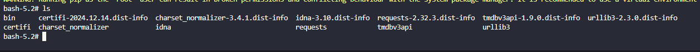
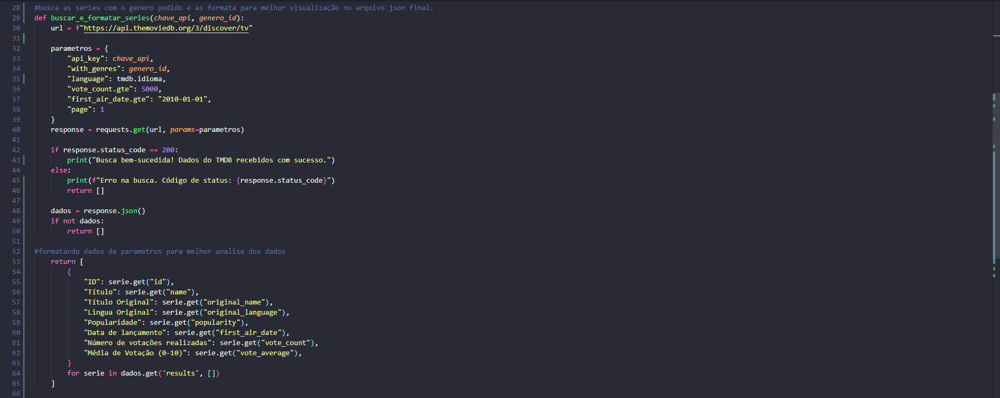
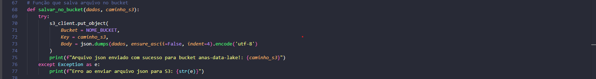
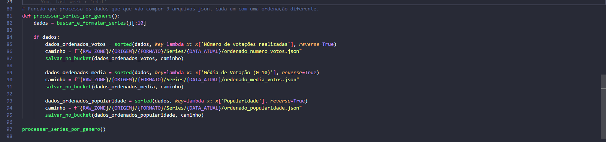
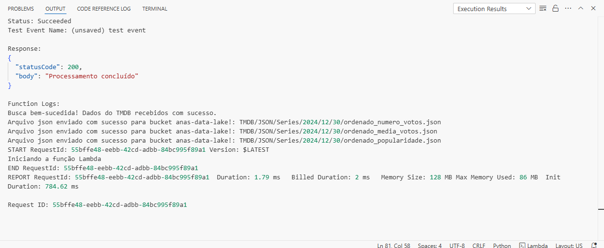
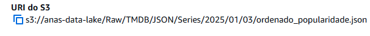

### Desafio Final: Entrega 2.

### 1. Primeira etapa.
#### (Criando camada do tmdb para uso no lambda.)
- *Arquivo Dockerfile*
- *Criação da imagem*
  

- *Criação do container, pastas e instalação da api no pacote que será transformado em camada*

- *Zipando a pasta e fazendo uma copia para o path definido*

### 2. Segunda etapa.
#### (Subindo apasta zipada para um bucket no S3.)

- *Criação da função-tmdb*

- *Criação da camada*
- *Adicionando camada*

### 3. Terceira etapa.
#### (Definindo variável de ambiente para melhor prática no código)

### 4. Quarta etapa.
#### (Elaboração do código para coleta de dados da API e produção dos arquivos json a serem enviados para o bucket anas-data-lake)

- *Prints no vscode local para melhor visualização*

### 5. Resultados. 
#### (Código rodado no lambda com sucesso)

- (Caminhos no bucket e diretórios corretos como solicitado)

### 6. Resultados.
#### (Arquivos gerados pelo código depois de feito download na maquina local)

