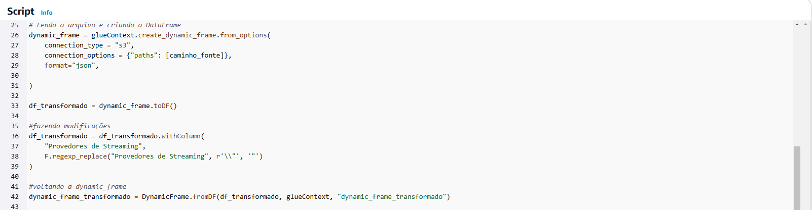

### Desafio Final: Entrega 4.

### 1. Primeira etapa.
#### (Criando e configurando o primeiro job para processar o arquivo CSV)

- *Processei apenas o arquivo sobre séries porque não irei usar o arquivo sobre filmes na minha análise.*

- *definindo variável de ambiente para mehor visualização no código*

### 1.1 código que processa o arquivo CSV e faz algumas alterações no mesmo.

- *deleção de colunas sobre atores que não serão usadas*
- *conversão de datatype para melhor manipulação futuramente*
- *filtragem de registros a partir de 2010*
- *filtragem de séries que continham pelo menos um dos gêneros (Sci-Fi ou Fantasia)*
- *deleção de linhas repetidas*

### 2. Segunda etapa.
#### (Criando e configurando o segundo job para processar os arquivos JSON.)

- *definindo variável de ambiente para mehor visualização no código*

### 2.2 código que processa os arquivos JSON (três top 10, ordenados cada um por uma variável).

- *A alteração nos arquivos foi a coluna "Provedores de Streaming", deixando-as com uma melhor visualização*

### 3. Terceira etapa.
#### (Rodandos os jobs)

### 4. Quarta etapa.
#### (Resultados: Caminhos no padrão determinado do bucket)

### 5. Resultados. 
#### (Criando database e crawler para checagem de resultados no athena)

### 6. Resultados.
#### (Tabelas criadas depois do crawler rodado)

### 7. Resultados.
#### (Tabela do CSV)

### 7. Resultados.
#### (Tabela dos JSONS)

