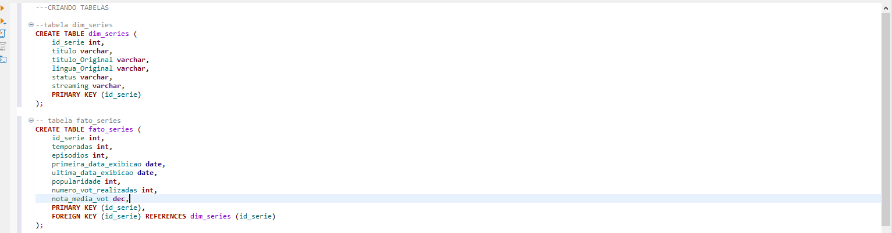
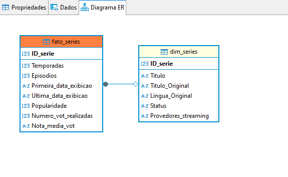
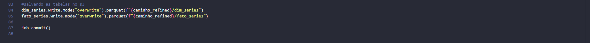
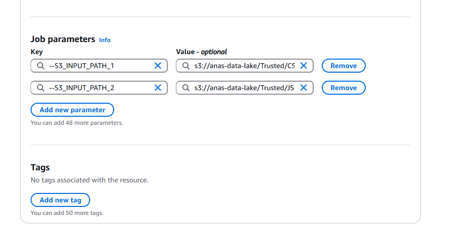
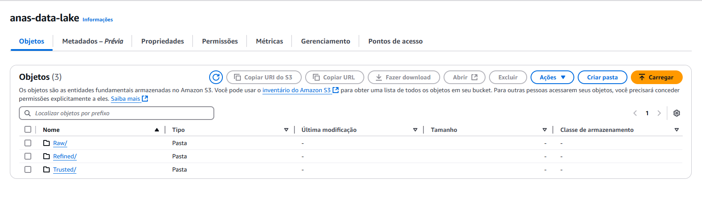
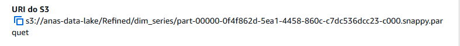
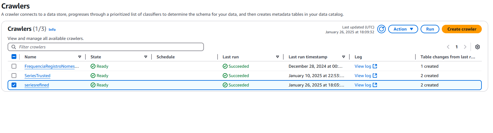
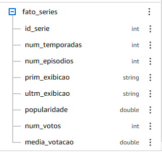

### Desafio Final: Entrega 4.

### 1. Primeira etapa.
#### (Criando modelagem multidimensional no dbeaver para visualização do diagrama)

1. Preferi começar por aqui para conseguir visualizar o diagrama e conseguir pensar melhor em como queria minhas tabelas.

- *Tabelas sem modelagem.*

- *Criando tabelas.*
  

- *Diagrama representando a modelagem multidimensional.*

- *Tabelas.*
  

### 2. Segunda etapa.
#### (Criação do job Glue)

- *Realiza o processamento e transformação de dados para montar uma modelagem multidimensional.*
  
1. Faço algumas inicializações.
     
2. Defino variáveis globais.
     
3. Inicializo leitura dos arquivos que tiveram seus caminhos definidos como variáveis de ambiente.
     

### 2.2

4. Faço a seleção de colunas do json e csv, renomeio colunas para melhor visualização.
  
5. Crio tabela diemnsão fazendo um join entre os dois documentos baseando-se na correspondencia entre as colunas "titulo" e "titulo_original"
 
6. A coluna "streaming" é "explodida" já que é uma lista, e caqda série pode contar com mais de um provedor de streaming.

    - *Preferi usar essa saída ao invés de criar uma tabela auxiliar, como são poucos dados não irá influir na hora de fazer as views*
  
7. Crio a tabela fato fazendo um select em quais colunas quero adicionar.

### 2.3

8. Salvo minhas tabelas no caminho definido no S3.

### 2.4 Visualização na plataforma da AWS e resultados.

- *Job e suas configurações pedidas.*

- *Definindo variáveis de ambiente.*

- *Job rodado com sucesso*

- *Camada Refined no S3.*

- *Caminhos dos parquets criados*

     

### 3. Terceira etapa.
#### (Criando database e crawler)

- *Database seriesrefined*

- *Crawler seriesrefined rodado com criação de duas tabelas com sucesso!*

- *Visualização das tabelas criadas com o crawler.*

### 4. Quarta etapa.
#### (Visualização das tabelas criadas no Athena.)

- *dim_series*

- *fato_series*

